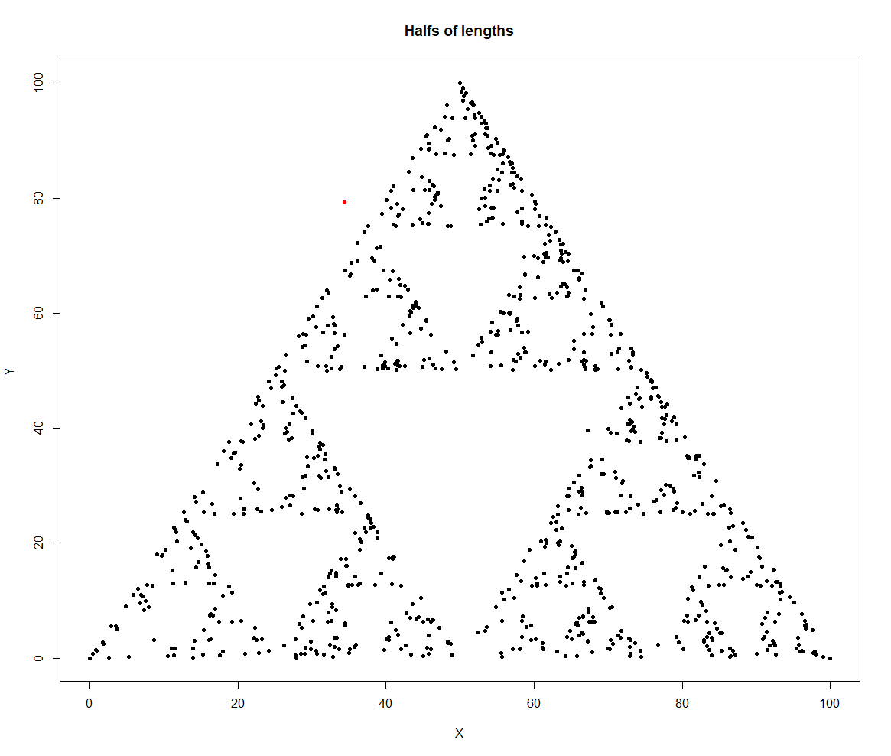
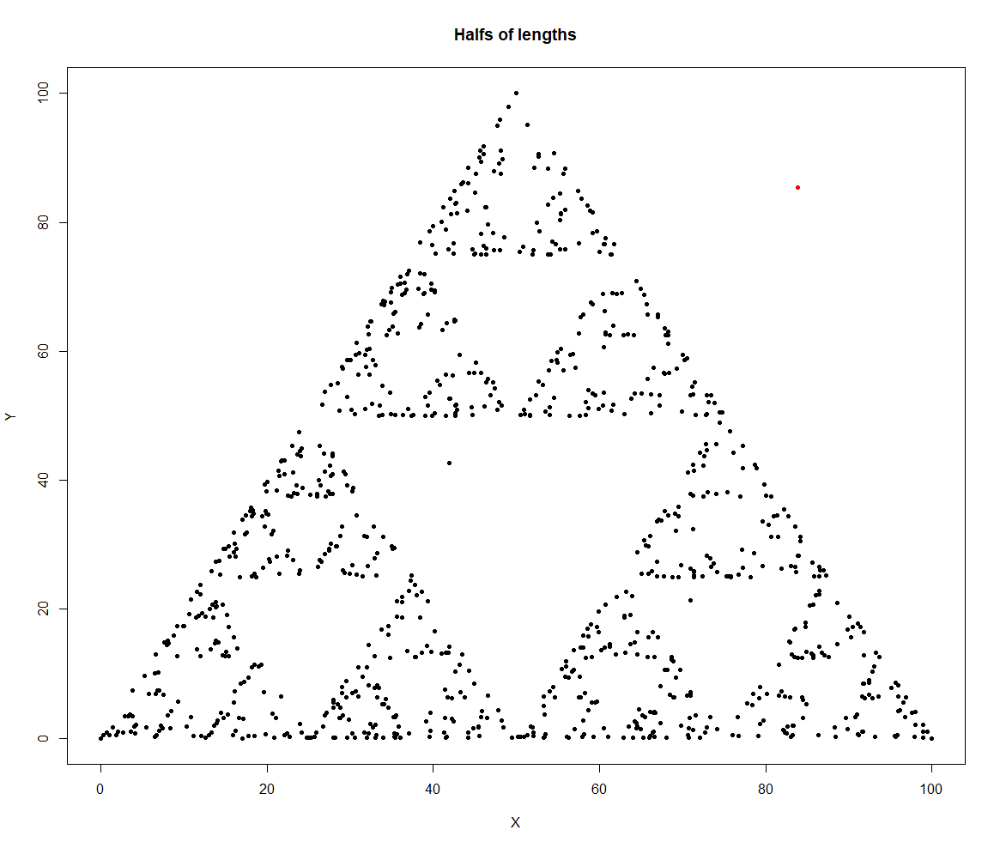
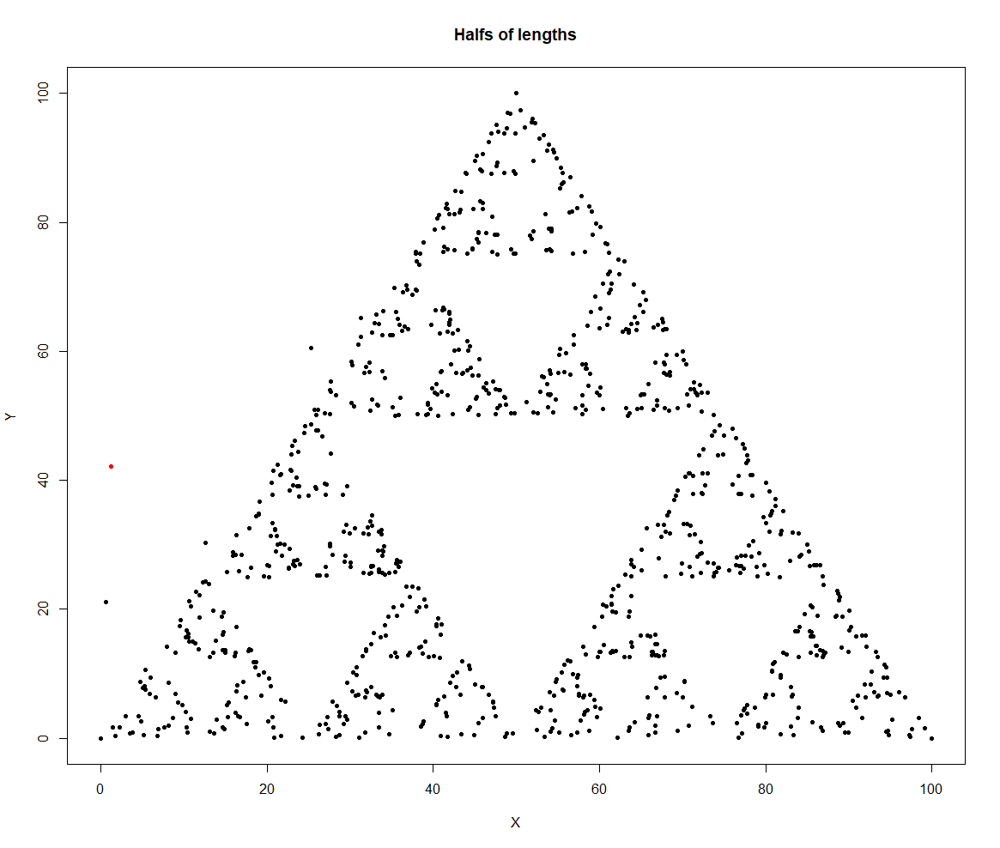
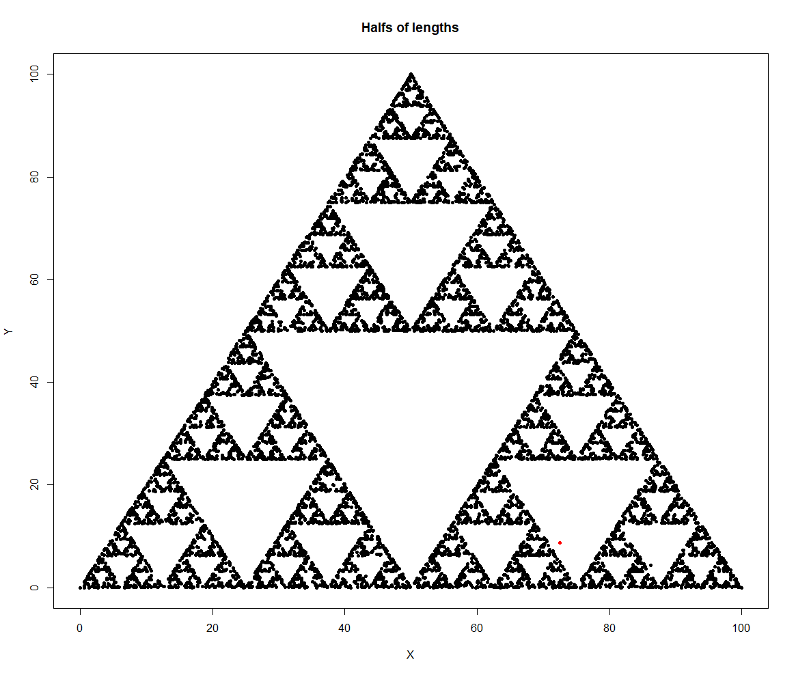
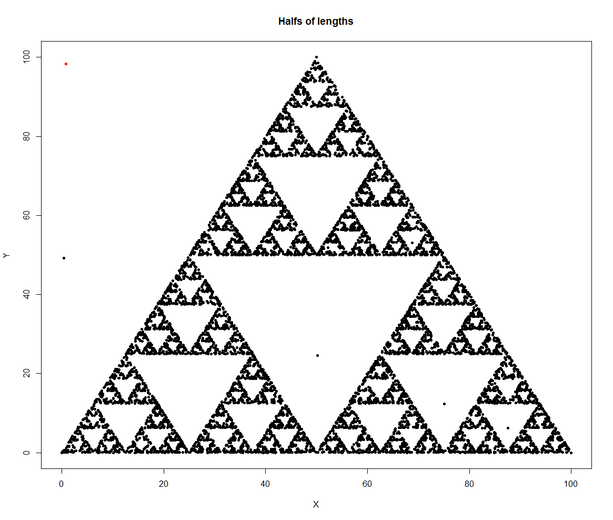
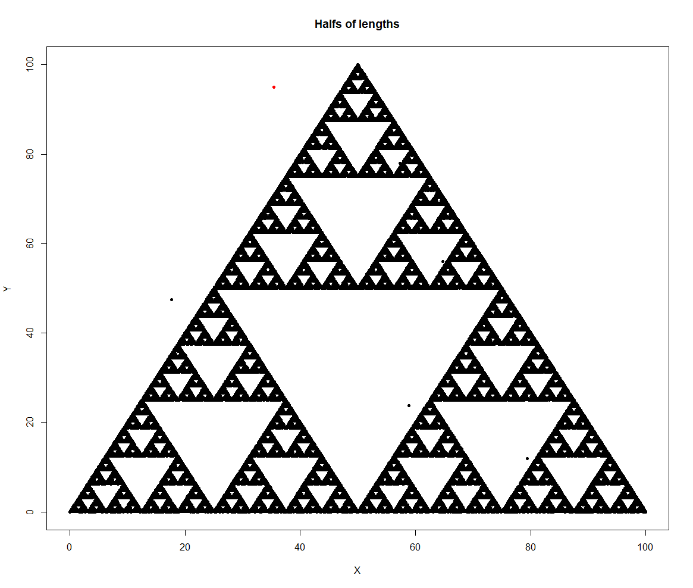

# HalfwayTriangle-R-

## ⚠️Refaktoryzacja⚠️ | ⚠️Refactoring⚠️

***[EN](https://github.com/4Maksio/HalfwayTriangle-R-/tree/main#en)*** | 
***[PL](https://github.com/4Maksio/HalfwayTriangle-R-/tree/main#pl)***

---

|**1K**||||
|---|---|---|---|
|**10K**||||
|**100K**||
|**1M**||

---

## [EN]

### The working files are before the commit "Start of refactoring"

The *[triangles.r](https://github.com/4Maksio/HalfwayTriangle-R-/blob/main/triangles.r)* script generates a simple fractal graphic based on triangles.

The generating algorithm is as follows:

1. setting the starting tops of the triangle
2. drawing the number of times desired by the user from 1 to 3, where each number is assigned to one of the tops
3. generating a random starting point
4. generating the remaining points according to the rule "the next point is in halfway between the current point and the choosen top from the list created in step 2."

The red dot illustrates the first point.

If you don't have the **R** interpreter installed and/or you want to skip the first dots that ruins the image, copy the code from the *[triangles_fixed.r](https://github.com/4Maksio/HalfwayTriangle-R-/blob/main/triangles_fixed.r)* file into any online **R** interpreter.

---

## [PL]

### Działające pliki znajdują się przed commitem "Start of refactoring"

Skrypt *[triangles.r](https://github.com/4Maksio/HalfwayTriangle-R-/blob/main/triangles.r)* generuje prostą grafikę fraktalną na bazie trójkątów.

Algorytm generujący wygląda następująco:

1. Ustawienie punktów początkowych trójkąta
2. Wylosowanie żądaną przez użytkownika liczbę razy liczby z zakresu od 1 do 3, gdzie każda z cyfr jest przyporządkowana jednemu z wierzchołków
3. Wygenerowanie losowego punktu początkowego
4. Wygenerowanie pozostałych punktów zgodnie z zasadą "kolejny punkt znajduje się w połowie drogi pomiędzy bieżącym punktem a wybranym wierzchołkiem z listy utworzonej w kroku 2."

Czerwona kropka obrazuje pierwszy punkt.

Jeśli nie masz zainstalowanego interpretera **R** i/lub chcesz pominąć pierwsze kropki, które burzą obraz, skopiuj kod z pliku *[triangles_fixed.r](https://github.com/4Maksio/HalfwayTriangle-R-/blob/main/triangles_fixed.r)* do dowolnego internetowego interpretera **R**.